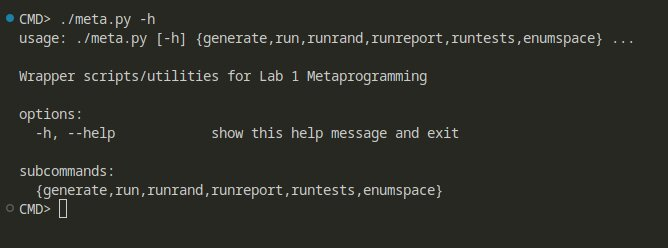
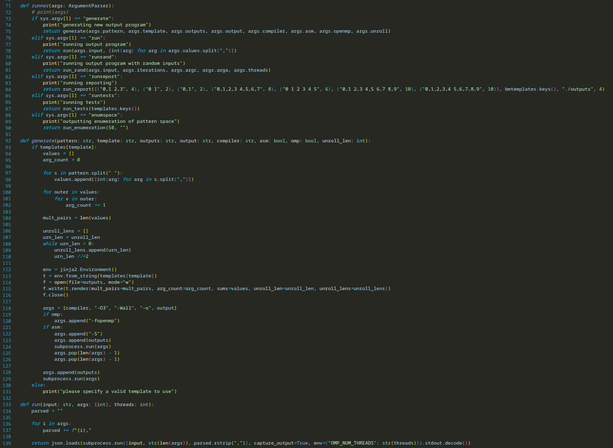
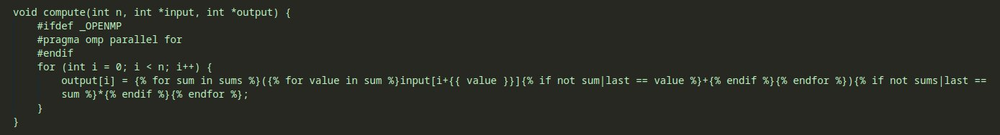
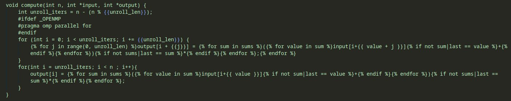
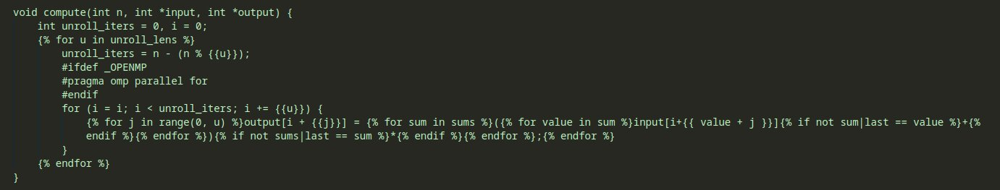

# Metaprogram overview

### CLI



### Metaprogram



# Optimizations Overview

### OpenMP (V1)



### Loop Unrolling

#### V2



#### V2.1



# OSACA

# Benchmarking Results

```{r, message=FALSE}
library(dplyr)
library(ggplot2)
```

```{r}
files <- list.files(path = "outputs", pattern = ".csv", full.names = TRUE)

datasets <- c()

# files
for (f in files) {
  dataset <- read.csv(f)$TIMINGS

  z <- ktrutils::get_z(dataset)
  dataset_pruned <- dataset[abs(z) < 3]

  print(summary(dataset))
  print(summary(dataset_pruned))
  boxplot(dataset_pruned,
    col = "Red", data = dataset_pruned, main = f,
    horizontal = TRUE
  )
  append(datasets, dataset_pruned)
}
```
